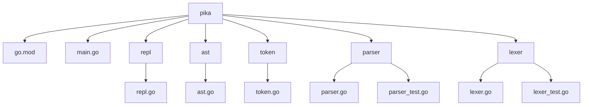

# Go Interpreter
## 🗂️ Description

The Go Interpreter, named Go-Interpreter, is a project that implements a Read-Eval-Print Loop (REPL) interpreter for a programming language, written in Go. This project is designed for developers and programming enthusiasts who want to understand the inner workings of an interpreter. The interpreter is capable of lexing, parsing, and executing a basic programming language.

The project provides a simple and easy-to-understand implementation of an interpreter, making it a great resource for educational purposes or for those looking to learn about interpreter design.

## ✨ Key Features

### Interpreter Core
* **REPL**: A Read-Eval-Print Loop that allows users to interact with the interpreter.
* **Lexer**: A lexer that breaks the input source code into tokens.
* **Parser**: A parser that constructs an Abstract Syntax Tree (AST) from the tokens produced by the lexer.
* **AST**: An Abstract Syntax Tree data structure that represents the source code.

### Testing
* **Unit Tests**: Comprehensive unit tests for the lexer, parser, and REPL components.

## 🗂️ Folder Structure

## 🛠️ Tech Stack

## ⚙️ Setup Instructions

To run the project locally, follow these steps:
* Clone the repository: `git clone https://github.com/jerkeyray/go-interpreter.git`
* Navigate to the project directory: `cd go-interpreter/pika`
* Run the interpreter: `go run main.go`
* Interact with the REPL: Type Go-like code and see the interpreter's output.

## 📝 Architecture

The interpreter consists of the following components:

### Lexer

The lexer is responsible for breaking the input source code into tokens. It is implemented in `pika/lexer/lexer.go`.

### Parser

The parser constructs an Abstract Syntax Tree (AST) from the tokens produced by the lexer. It is implemented in `pika/parser/parser.go`.

### AST

The AST represents the source code as a tree data structure. It is defined in `pika/ast/ast.go`.

### REPL

The REPL reads user input, lexes it, parses it, and prints the output. It is implemented in `pika/repl/repl.go`.

## 🤖 GitHub Actions

This project uses GitHub Actions for automated testing. The workflow is defined in `.github/workflows/main.yml` and runs unit tests for the lexer, parser, and REPL components.

## 📊 Testing

The project includes comprehensive unit tests for the lexer, parser, and REPL components. The tests are written in Go and can be run using the `go test` command.

  

<h3>Aditya Srivastava</h3>

Consummate tinkerer.

 

  <a href="https://gitfull.vercel.app">Made by GitFull</a>

    