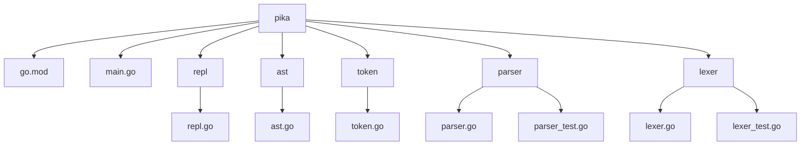
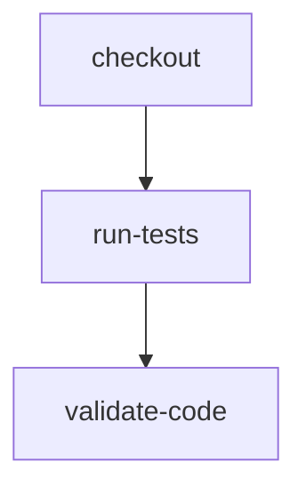

# Go Interpreter
## 🗂️ Description

The Go Interpreter is a software project that implements a Read-Eval-Print Loop (REPL) for a programming language. The project is designed for developers and programmers who want to experiment with a custom language or evaluate the feasibility of a new language design. The interpreter allows users to input code, tokenize it, parse it into an Abstract Syntax Tree (AST), and execute it.

The project provides a basic structure for building a programming language, including a lexer, parser, and REPL. It serves as a foundation for further development and customization of the language.

## ✨ Key Features

### **Language Fundamentals**
* **Lexer**: Tokenizes input into a stream of tokens
* **Parser**: Constructs an Abstract Syntax Tree (AST) from the token stream
* **AST**: Represents the source code in a tree-like data structure

### **REPL and Execution**
* **REPL**: Reads user input, evaluates it, and prints the result
* **Interpreter**: Executes the AST and returns the result

### **Testing and Validation**
* **Unit tests**: Ensures the lexer, parser, and interpreter work correctly

## 🗂️ Folder Structure

## 🛠️ Tech Stack

## ⚙️ Setup Instructions

To run the project locally:

* Clone the repository: `git clone https://github.com/jerkeyray/go-interpreter.git`
* Navigate to the project directory: `cd go-interpreter/pika`
* Initialize the Go module: `go mod init`
* Run the interpreter: `go run main.go`

## 📝 Architecture

The project consists of the following components:

* **Lexer** (`pika/lexer/lexer.go`): takes input and produces a stream of tokens
* **Parser** (`pika/parser/parser.go`): takes the token stream and constructs an AST
* **AST** (`pika/ast/ast.go`): represents the source code in a tree-like data structure
* **Interpreter** (`pika/main.go`): executes the AST and returns the result
* **REPL** (`pika/repl/repl.go`): reads user input, evaluates it, and prints the result

## 🤖 GitHub Actions

This project uses GitHub Actions for automated testing and validation. The workflow is defined in `.github/workflows/main.yml` and runs on every push event. It performs the following tasks:

* **Checkout code**: checks out the repository code
* **Run unit tests**: runs unit tests for the lexer, parser, and interpreter
* **Validate code**: validates the code formatting and syntax

  

<h3>Aditya Srivastava</h3>

Consummate tinkerer.

 

  <a href="https://gitfull.vercel.app">Made by GitFull</a>

    